# **PeachCode_RentalSystem**

RentalSystem(`Rent, Product Rent`) is a Magento 2 module that enables customers to rent products from your store. This module offers extensive rental management features for both the admin panel and storefront, allowing you to efficiently offer rental services.

Features:

### 1. Rent Any Product

   Customers can rent any product available in your store, providing flexibility and expanding the range of services you can offer.

### 2. Configure Products for Rental

   Admins can configure products in the admin panel to be available for rent. This includes:

1. Setting the rental price
2. Defining the quantity available for rent
3. Setting the maximum number of products a customer can add to their rental cart

### 3. Configure Discounts

   Admins can set up discounts based on the rental duration. For example, a 10% discount can be applied if the rental period exceeds 5 days. These settings are managed from the admin panel.

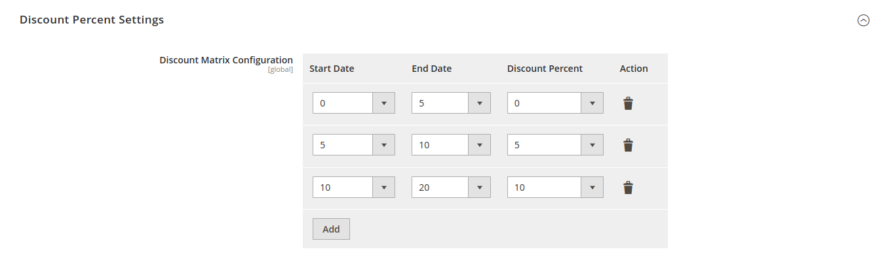

### 4. Store Pickup Locations

   Configure the stores where customers can pick up their rented products. This adds convenience for customers and helps manage logistics effectively.

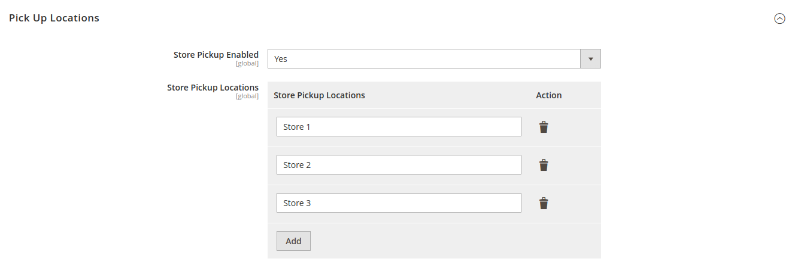

### 5. Administrator Notifications

   Admins receive notifications for new rental orders, ensuring they are always informed and can process orders promptly.

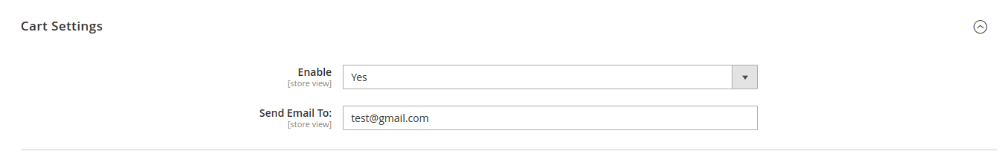

### 6. Rent Cart Limitation

Limiting the quantity of products in the rental cart:
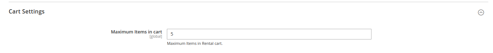

### 7. Rental History

   Customers can view their rental history in their account, providing transparency and allowing them to track their rental activities.

Customer Account page:
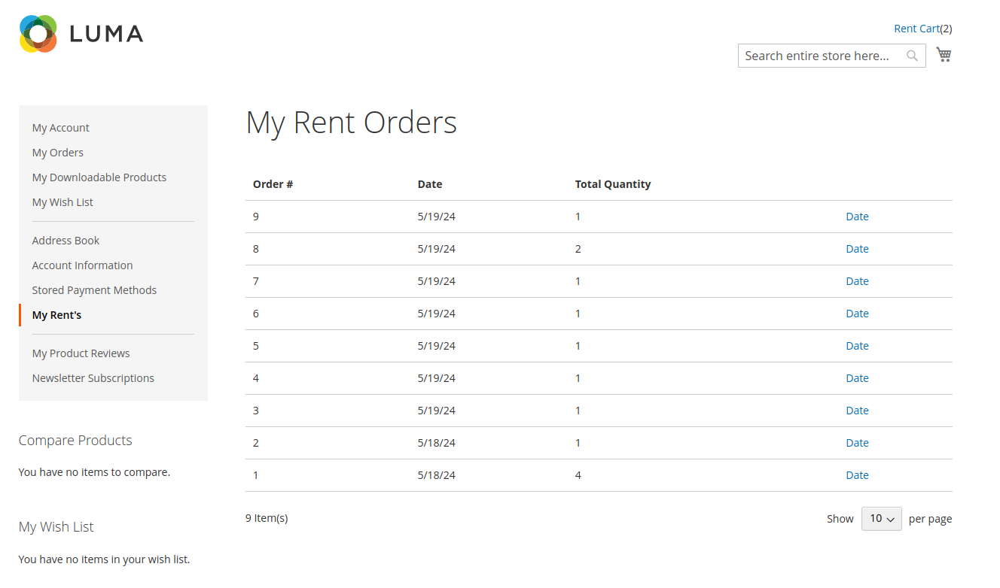

Rental Order Page:
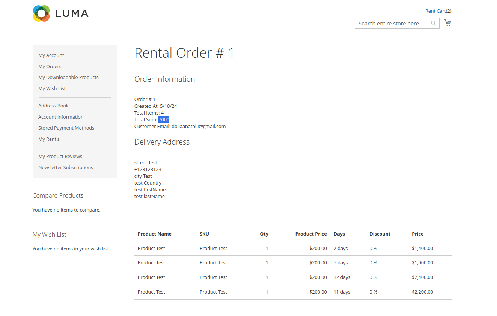

### Limitations of the Free Version

In the free version of the module, admins cannot view orders directly from the admin panel. This feature is available in the premium version.

### TODO:

We are continuously working to improve PeachCode_RentalSystem. Here are some upcoming features and improvements:

1. Add customer data to the rent cart section.
2. Update the save process.
3. Update the data selection process on the product page.

## Installation

To install the PeachCode_RentalSystem module, follow these steps:

1) **`composer require peachcode/rentalsystem:dev-main`**
 
2) Download the module package.
    Extract the package into the app/code/PeachCode/RentalSystem directory. 

Run the following commands:
<pre>
bin/magento setup:upgrade
bin/magento setup:di:compile
bin/magento setup:static-content:deploy
bin/magento cache:flush
</pre>

Log in to the admin panel and navigate to
`Stores -> Configuration -> PeachCode -> RentalSystem ` to configure the module settings.

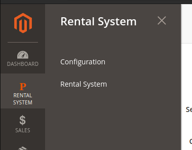

### Configuration

 
After installing the module, you can configure it by navigating to the configuration section in the admin panel. Here, you can set rental prices, configure discounts, and set up store pickup locations.

# How module works?

### Product page:

On the product page, you will find the option to rent the product.

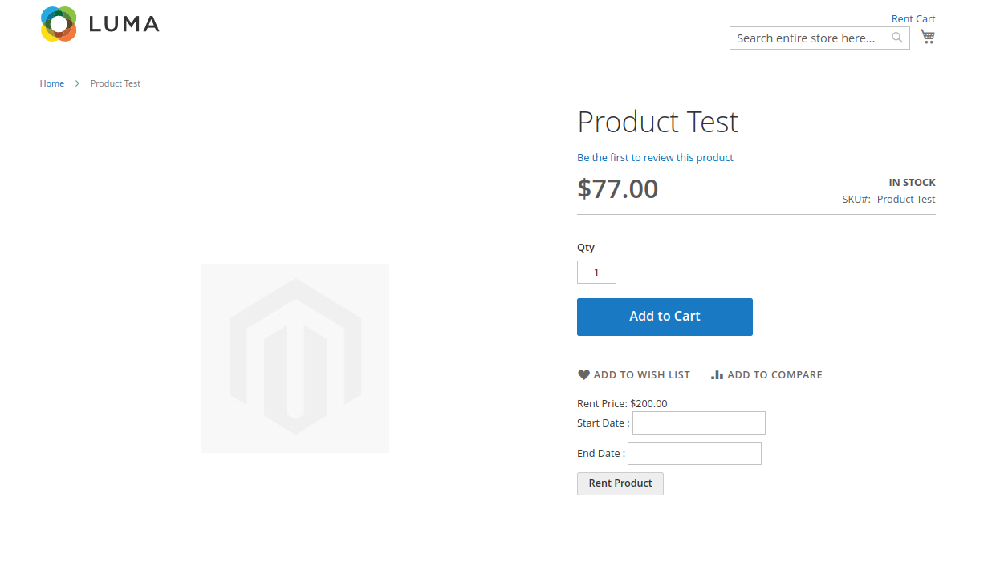

### Choosing Start Date and End Date

You need to select the Start Date and End Date for your rental.
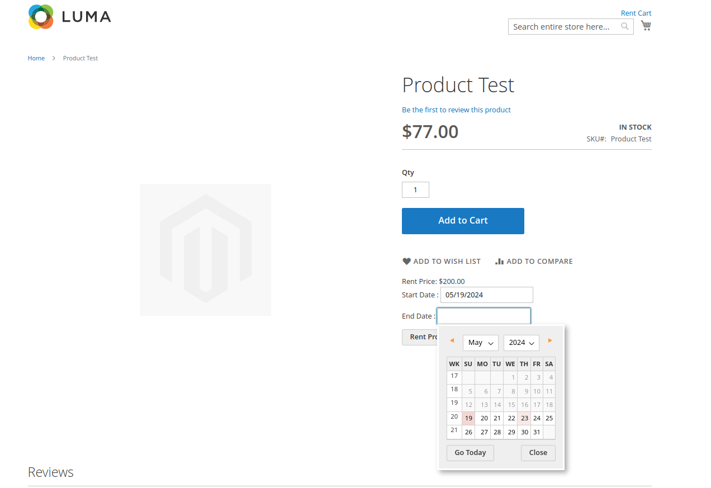

After successfully adding the product to your cart, you will see a success message.  
The link to the rent cart can be found in the page header.
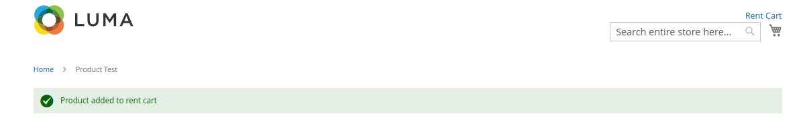

### Rent Cart View

On the `rent/cart/view/` page, you can fill in the following information:
1) Stores
2) Payment method
3) Customer information

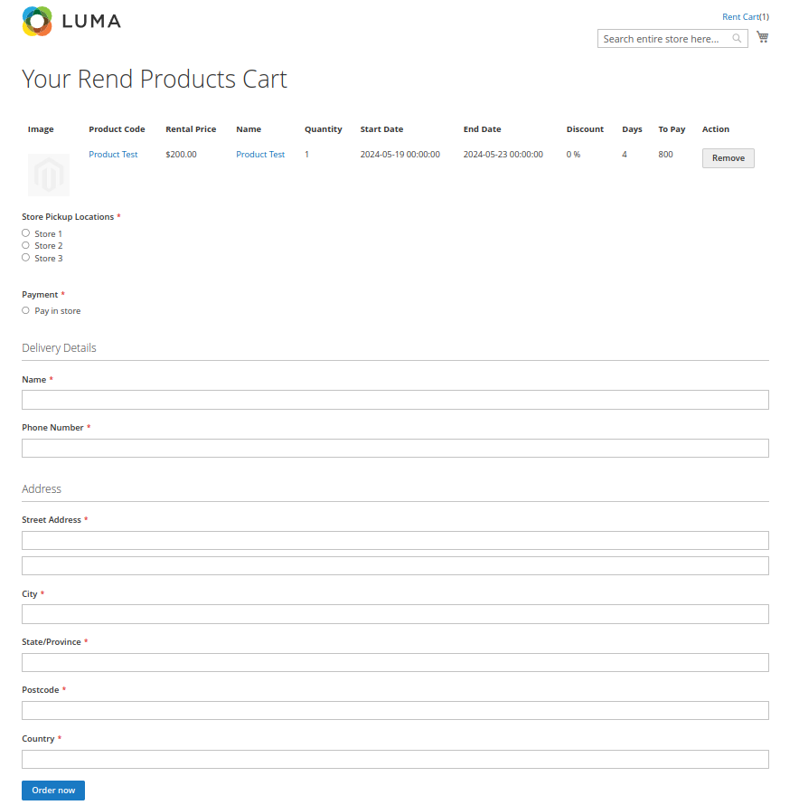

### Cart Information

On this page, you will find all the cart information.  You can also remove a product from the cart.
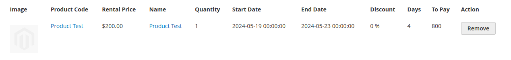

### Placing the Order

After placing the order, you will be redirected to the order confirmation page.
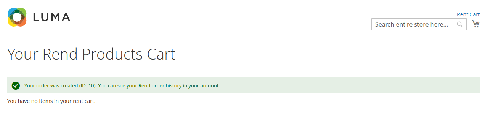

### Email Order Confirmation

You will receive an email confirmation of your order.
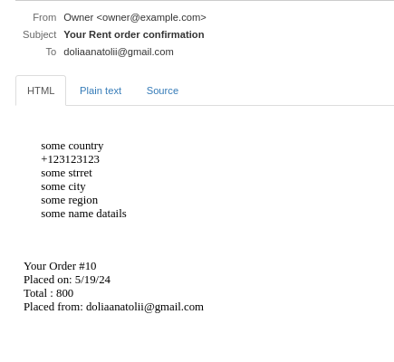

# Customer Account:

Customers can view their rental history in their account, providing transparency and allowing them to track their rental activities.

Customer Account page:

Rental Order Page:

### Contact

If you have any questions or need further assistance, please feel free to contact me through my account or email. I would be happy to assist you.

### Contact Details

[Anatolii Dolia](mailto:doliaanatolii@gmail.com) 
https://anatoliidolia.github.io/
